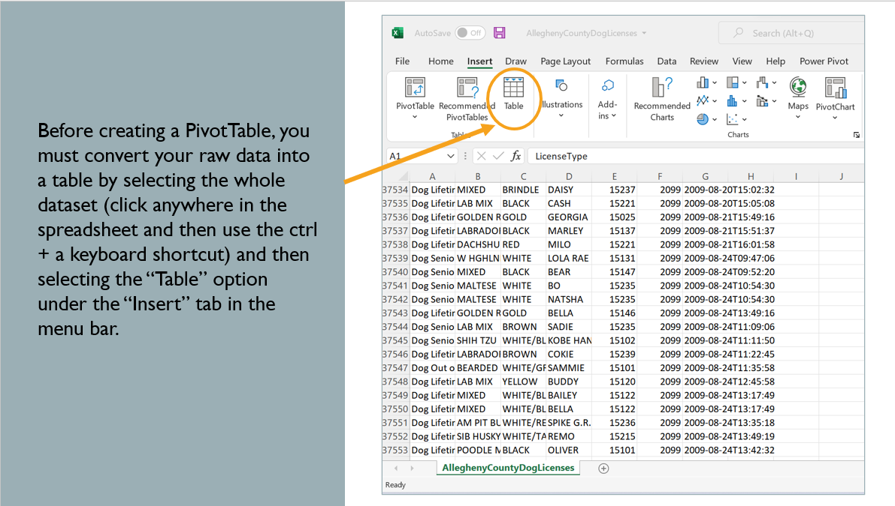
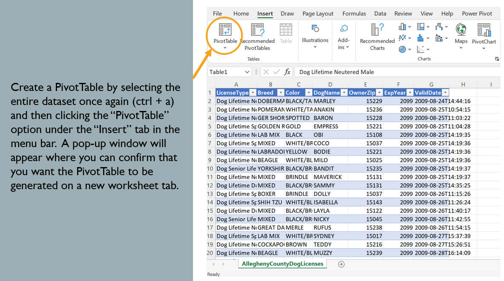
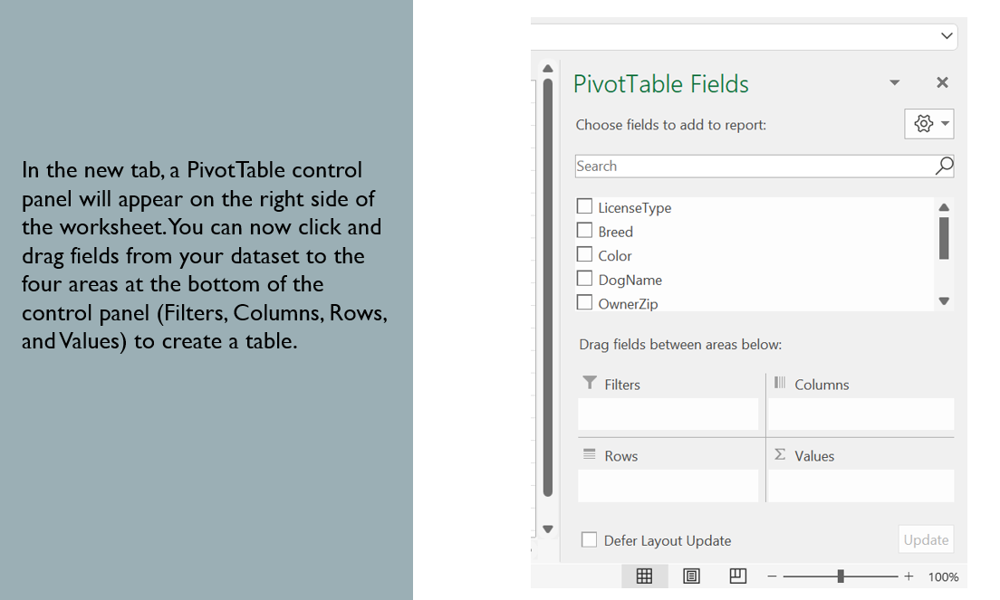
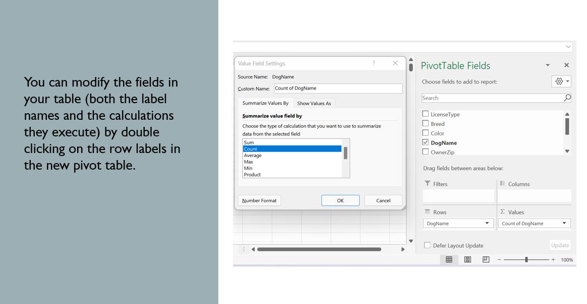
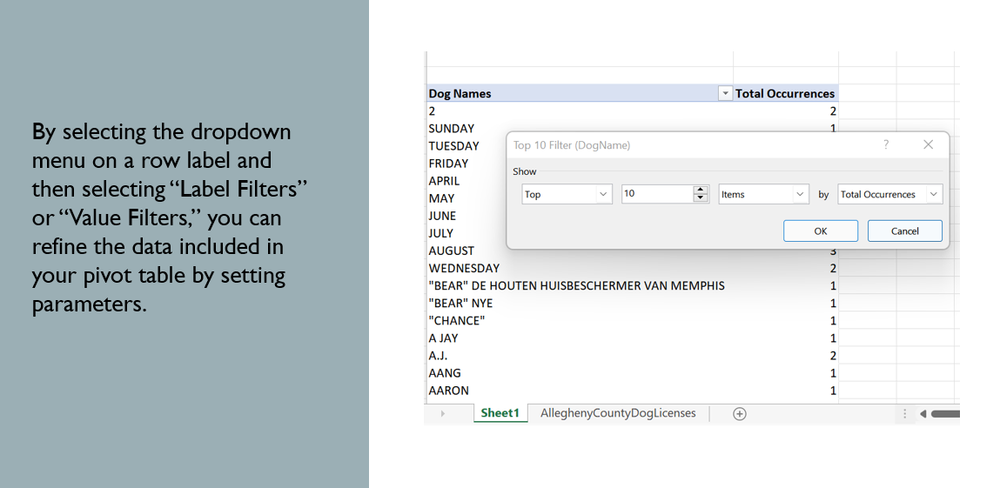

# excel_pivot_tutorial
## A tutorial for using PivotTable in Excel to aggregate data and create a top 10 list of values 

This tutorial uses a public dataset of dog licenses in Allegheny County, Pennsylvania, which is available to download as a CSV [here](https://data.wprdc.org/dataset/allegheny-county-dog-licenses). The instructions can be used to create a top 10 list of the most frequently occurring dog names in the dataset. 

### Overview

Pivot tables are tools used in data analysis to highlight key insights and/or aggregate data from a dataset.
While this demonstration will use Microsoft Excel, many other popular software packages have pivot table functionality, too.

This demo covers:

  * How to convert a raw dataset into an Excel PivotTable
  * How to aggregate and filter data using PivotTable’s built-in Label and Value Filters
  * How to format PivotTables so that they are ready to be shared

